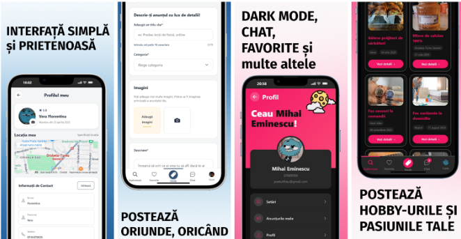

## Hobbiz-mobile-app

Hobbiz este o aplicație mobilă cross-platform (Android/iOS) cu platformă dedicată (www.hobbiz.ro) unde utilizatorii își pot publica anunțuri în vederea monetizarii hobby‑urilor. Hobbiz are ca scop transformarea pasiunilor în sprijin financiar — fie pentru a le susține și dezvolta, fie pentru a genera un venit suplimentar.

# Demo

---

## 📱 Aplicația mobilă 

Hobbiz oferă o experiență mobilă nativă completă dezvoltată cu **Expo** și **React Native**, optimizată pentru iOS și Android. Aplicația permite utilizatorilor să:

- **Exploreze anunțuri** - Poți naviga prin categorii și descoperi hobby-uri și servicii locale pe care ai vrea să le soliciți
- **Încarce certificări/atestate/diplome** - Utilizatorii pot trimte către adminii platformei orice fel de documente demonstrative în vederea obținerii unui
badge de verificare pentru construirea încrederii în rândul clienților(direct în aplicație)
- **Schimbe limba aplicației** - Deocamdată avem implementată doar limba română și engleză(urmează să mai adaugăm pe viitor)
- **Colaboreze** - Printr-un buton dedicat, aceștia pot decide dacă vor să facă negocieri între ei, și doar apoi pot să își lase review-uri unul altuia
- **Publice anunțuri** - Creează și editează anunțuri direct de pe telefon
- **Comunice în timp real** - Chat privat cu notificări și typing indicators
- **Gestioneze contul** - Profil personalizat cu avatar, setări și autentificare Google OAuth(în viitor +Facebook, Apple)
- **Gestioneze favorite** - Salvează și accesează rapid anunțurile preferate